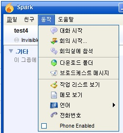

# OpenFire + Asterisk IM 설정

## OpenFire 설치방법
### OpenFire 소스버전 설치
> [OpenFire 소스 받기(GitHub)](https://github.com/igniterealtime/Openfire.git) 를 통해 다운로드 받거나,
> git clone을 통해 다운로드 받는다.
```
git clone https://github.com/igniterealtime/Openfire.git
```

### Eclipse에 소스 적용과 실행하는 방법
 > [Openfire SVN + Eclipse 3.3 + Subversive Installation Guide](https://community.igniterealtime.org/docs/DOC-1020) 에 나와있음.
 > 소스에는 SVN을 통한 연동이라고 되어있지만 이미 git으로 받았으니 받은 git 소스를 이클립트 프로젝트에 임포트 하면 됨.

## Spark 설치
 - OpenFire의 XMPP를 접속할 수 있는 Client.
 - 아래의 경로에서 소스를 받는다.
 ```
 git clone https://github.com/igniterealtime/Spark.git
 ```
 - 소스를 받는 이유 : 무슨 이유인진 몰라도 정식 홈페이지의 설치버전은 항상 SSL로 로그인을 요청한다.(소스버전은 그걸 비활성화하는 옵션이 존재)
 - 소스를 다운 받은 후 build 폴더에서 ant를 실행하면 컴파일을 하고, 정상적으로 완료 되면 target/build/bin/startup.bat or startup.sh 로 실행 가능함.
 - 실행이 되면 로그인 하기 전 하단 중앙의 '기타 설정' 버튼을 클릭해 아래의 옵션을 체크한다.
 -  
 
 
## FreePBX + Asterisk 설치
 - 원래는 Asterisk만 깔면 되지만 Asterisk만 설정할 자신이 없어서 패키지로 되어있는 걸 선택.
 
### 설치방법
 - 아래의 두 링크를 참조하여 설치함.
 > [음성통화 서버 Asterisk + FreePBX 구축](http://blog.djjproject.com/143)
 > [음성통화 서버 Asterisk + FreePBX / 통화 시연해보기](http://blog.djjproject.com/144)
 
> #### 링크 외 확인사항
> 1. extensions에 등록시 Advanced 탭의 Context 값을 확인한다.
> 
> 나중에 OpenFire에 등록할 때 필요한 값이다.( 현재는 from-internal 이라는 값이 세팅되어있다.)
> 2. Asterisk Manager를 등록한다.
> - OpenFire 구동 시 연동할 목적으로 사용된다.
> Settings -> Asterisk Manager Users 메뉴를 선택
> 
> Add Manager 버튼을 눌러 매니저 아이디를 등록한다.(아래의 스크린샷은 이미 등록한 예를 보여줌.)
> 

## OpenFire 설정

### Asterisk-IM Plugin 설치
> openfire 화면에 Plugins 탭으로 이동한다.
> Upload Plugin 에서 jar파일(해당 git의 asterisk-im 폴더의 asterisk-im.jar를 사용)을 선택한 후  Upload Plugin 버튼을 눌러 Plugin을 적용시킨다.
> 

### Asterisk-IM 설정
> 설치를 마치게 되면 Plugins탭 옆에 Asterisk-IM 탭이 생기게 된다.
#### General Settings
> Add Server를 눌러 다음과 같이 등록한다.
> 
> Server Name : 아무 이름이나 상관없음.
> Server Address : Asterisk Server IP
> Port : 5038을 사용한다.
> Username : Asterisk 설정 부분에서 Manager User로 등록한 부분의 아이디를 입력.
> Password : Asterisk 설정 부분에서 Manager User로 등록한 부분의 비밀번호를 입력.
#### Phone Mappings
> * 등록된 jid를 sip 번호와 매핑을 시켜준다.
>  
> Username : 등록되어있는 jid에서 도메인을 제외한 아이디를 적는다.
> Device : SIP/ prefix에 Extension Number를 붙힌다.(이렇게 해야 작동함.)
> Extension : Asterisk에서 등록한 Extensions Number를 등록한다.
> Caller ID : 해도그만 안해도 그만
> Primary : 선택한다.


## 확인
> - Spark를 통해 SIP 번호가 매핑된 JID로 로그인을 하면  동작 메뉴에 전화번호 라는 항목이 생기면 제대로 매핑이 된 것이다.
> - 
 
### 문제발생
> - 원래는 친구를 선택 후 Call 을 누르면 전화가 되는 방식인데, 어떤 이유에서인지 Spark에서 만드는 패킷과 서버가 확인하는 메세지의 차이가 있다.
> Spark에서 보내는 패킷
```
<iq to="phone.10.100.1.83" id="cYJ2c-158" type="set">
  <phone-action xmlns="http://jivesoftware.com/xmlns/phone">
    <phone-action xmlns="http://jivesoftware.com/xmlns/phone" type="DIAL">
      <jid>test3@10.100.1.83</jid>
    </phone-action>
  </phone-action>
</iq>
```
> 서버에서 받아야 하는 패킷
````
<iq to="phone.10.100.1.83" id="cYJ2c-158" type="set">
    <phone-action xmlns="http://jivesoftware.com/xmlns/phone" type="DIAL">
      <jid>test3@10.100.1.83</jid>
    </phone-action>
</iq>
````

> 그래서 임시로 Spark에서 제공하는 커스텀하게 패킷을 보낼 수 있는(파일 -> Send Packets)에서 옳바른 패킷을 넣고 테스트를 진행한다.
> 
> 이렇게 해서 Send 버튼을 누르면 해당 사용자의 SIP번호가 등록되어있는 단말기로 Ring이 울리게 된다.
>> Spark에서는 전화를 받은 상태, 끊은 상태만 표시되고 실제로 전화를 받을 순 없는 상황이다.
>> 예전 스크린샷에는 다이얼패드도 있고 수신 화면도 있는데 현재 그 버전은 구버전이라 윈도우 10에선 돌아가지 않는다.


### XMPP를 통한 SIP Call을 하는 절차
> 1. XMPP에서 jid를 이용하여 메세지를 보낸다.
> 2. 서버는 해당 jid에 매핑되어있는 SIP 번호를 찾아 Ring을 호출한다.(XMPP의 상태 메세지가 통화중으로 변경된다.)
> 3. 해당 사용자가 전화를 받게 되면 XMPP 메세지를 통해 내 전화의 벨이 울리게 된다.
> 4. 통화를 시작한다.
> 5. 통화를 종료한다.(XMPP의 상태메세지가 일반으로 변경된다.)


